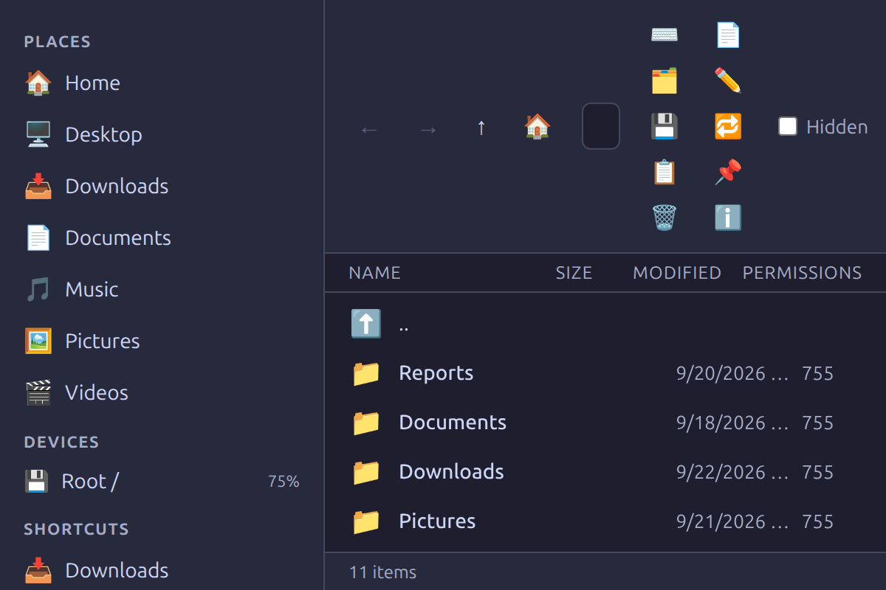
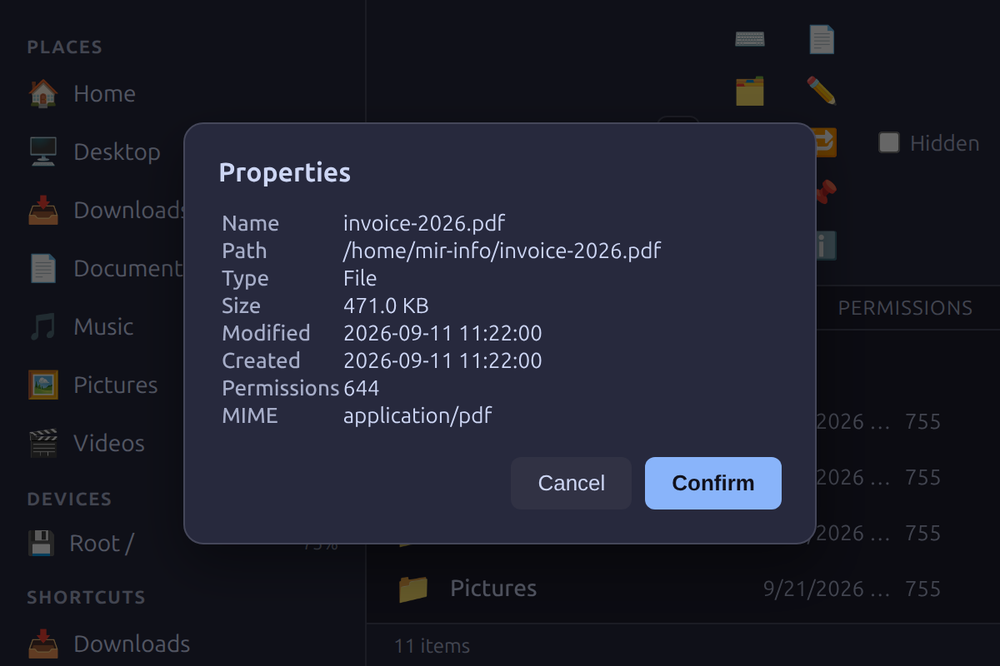
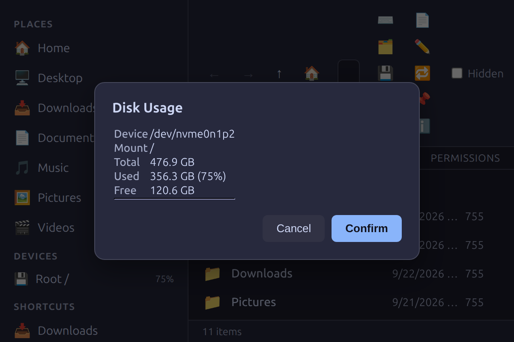

<!--
  File Manager — Documentation
  SEO metadata (used when rendering this page to HTML):
  <title>File Manager for Ubuntu Linux — Fast Open-Source Tauri App</title>
  <meta name="description" content="File Manager is a fast, open-source file management tool for Ubuntu and other Linux distributions. Built with Rust and Tauri 2, it features search, duplicate detection, batch rename, disk usage analytics, trash integration and a dark modern UI. Download the .deb or AppImage or build from source.">
  <meta name="keywords" content="linux file manager, ubuntu file manager, open source, tauri app, rust file manager, duplicate finder, batch rename, disk usage, gtk, deb, appimage, file explorer">
-->
# File Manager — Documentation

> **File Manager** is a fast, modern, open-source file management system for **Ubuntu / Linux**, built with **Rust** and **Tauri 2**. Lightweight, keyboard-friendly, and privacy-respecting — your files never leave your machine.

**Quick links:** [Features](#features) · [Screenshots](#screenshots) · [Quick Start](#quick-start) · [Usage Guide](#usage-guide) · [Keyboard Shortcuts](#keyboard-shortcuts) · [FAQ](#faq) · [Troubleshooting](#troubleshooting) · [Build from Source](#build-from-source)

---

## What is File Manager?

File Manager is a desktop file explorer designed for speed and simplicity on Linux. Unlike heavyweight file managers, it launches instantly, consumes minimal memory, and ships as a single native binary. It is fully open source under the MIT license.

**Why choose it?**

- ⚡ **Fast** — native Rust backend, no Electron memory overhead
- 🖥️ **Modern dark UI** — clean, distraction-free interface
- 🔍 **Search & duplicates** — find files by name and detect duplicate content via SHA-256
- 🗑️ **Trash integration** — safe delete with XDG trash support
- 📦 **Native packages** — `.deb`, `.rpm`, and `.AppImage` for easy install

---

## Screenshots

*Illustrative renders of the app UI (dark theme), generated with the real stylesheet and representative sample data.*

### Main window



*Browse your home folder with sidebar shortcuts, path navigation, and per-file metadata.*

### File properties dialog



*Right-click any file → Properties for detailed metadata, including permissions and MIME type.*

### Disk usage panel



*The Disk Usage panel (toolbar 💾) shows every mounted device with capacity bars.*

> Screenshots can be regenerated at any time with [`docs/regenerate-screenshots.sh`](regenerate-screenshots.sh).

---

## Features

| Feature | Description |
|---------|-------------|
| Directory browsing | Back/forward/up navigation, path bar, breadcrumb support |
| Name search | Recursive, case-insensitive search with configurable depth |
| Copy / Cut / Paste | Auto-rename on conflict, e.g. `photo (copy 1).jpg` |
| Move to Trash | Safe delete via XDG Trash; permanent delete also available |
| Create / Rename | Create files and folders, rename in place |
| Duplicate finder | Groups duplicate files by size, then SHA-256 content hash |
| Batch rename | Pattern + counter with zero-padding, e.g. `photo_001` |
| Disk usage | Per mount-point total / used / free with percentages |
| Hidden files | Toggle visibility (setting persisted on disk) |
| Sidebar | Home, Desktop, and XDG user directories + mounted devices |
| Context menu | Open, rename, copy, cut, paste, delete, properties |
| Terminal | Open a terminal at the current folder (`Ctrl+T`) |
| Dark theme | System-native dark UI with per-file-type icons |

---

## Quick Start

The simplest way to run File Manager:

```bash
# 1. Install system dependencies (Ubuntu/Debian)
./setup-deps.sh

# 2. Build & run in dev mode (hot reload)
cargo tauri dev

# 3. Or launch the compiled debug binary directly
./target/debug/file-manager
```

> Requires the Rust toolchain (edition 2024) and Tauri CLI:
> `cargo install tauri-cli --locked`

### Install a release package

```bash
# Build native installers
cargo tauri build --bundles deb,appimage,rpm

# Install the generated package
sudo apt install ./target/release/bundle/deb/file-manager_0.1.0_amd64.deb
```

---

## Usage Guide

### Navigation

- Click the **Home** button (🏠) or use `Backspace` to go up a folder.
- Type a full path into the path bar and press `Enter`.
- Use the **sidebar** to jump to Home, Desktop, Downloads, Documents, Music, Pictures, and Videos.
- Mounted devices appear under **Devices** with used-space percentages.

### File operations

| Action | How |
|--------|-----|
| Open a folder | Double-click, or right-click → Open |
| Open a file | Double-click (launches the default application) |
| Copy | Select → `Ctrl+C` or toolbar 📋 |
| Cut | Right-click → Cut |
| Paste | `Ctrl+V` or toolbar 📌 |
| Rename | `F2` or toolbar ✏️ (rename multiple selected files for batch rename) |
| Move to Trash | `Delete` or right-click → Move to Trash |
| Delete Permanently | Right-click → Delete Permanently |
| New File | `Ctrl+N` or toolbar 📄 |
| New Folder | Toolbar 🗂️ |
| Search | `Ctrl+F` |
| Find duplicates | Toolbar 🔁 (searches current folder) |
| Disk usage | Toolbar 💾 |

### Selection

- Single click selects an item.
- `Ctrl+Click` toggles multi-select.

---

## Keyboard Shortcuts

| Key | Action |
|-----|--------|
| `Backspace` | Go up one folder |
| `Delete` | Move selected items to Trash |
| `F2` | Rename selected item |
| `Ctrl+C` | Copy selection |
| `Ctrl+V` | Paste clipboard |
| `Ctrl+H` | Toggle hidden files |
| `Ctrl+F` | Search by file name |
| `Ctrl+R` | Refresh current folder |
| `Ctrl+N` | Create a new file |
| `Ctrl+T` | Open terminal in current folder |

---

## FAQ

**Is File Manager free?**
Yes — it is open source under the [MIT license](../LICENSE).

**Which Linux distributions are supported?**
Ubuntu/Debian (.deb), Fedora/RHEL (.rpm), and any distribution that supports AppImage. The runtime requires `webkit2gtk-4.1`, GTK 3, and `librsvg2` (listed in `setup-deps.sh`).

**Does it upload or collect any data?**
No. All operations run locally on your machine. The only file the app writes is a small settings file in your cache directory (`~/.cache/file-manager/`) to remember your hidden-files preference.

**Can I detect duplicate files?**
Yes. The 🔁 toolbar button scans the current folder, groups files by size, then verifies duplicates by SHA-256 content hash.

**What is the technology stack?**
Rust 2024, Tauri 2, and a vanilla HTML/CSS/JS frontend. See [`Cargo.toml`](../Cargo.toml) for the full dependency list.

**How do I install the Tauri CLI?**
```bash
cargo install tauri-cli --locked
```

---

## Troubleshooting

- **`cargo build` fails with `pkg-config ... glib-2.0 was not found`:**
  System dev packages are missing. Run `./setup-deps.sh` or install `libwebkit2gtk-4.1-dev libgtk-3-dev libglib2.0-dev librsvg2-dev`.

- **The app window is empty and its "Confirm / Cancel" dialog does nothing:**
  Make sure `src/frontend/styles.css` contains a `.hidden { display: none !important; }` rule and that `tauri.conf.json` sets `"withGlobalTauri": true`. Without `withGlobalTauri`, `window.__TAURI__` is undefined and the UI never initializes.

- **`error[E0433]: cannot find module or crate tauri_build` in `build.rs`:**
  The `[build-dependencies] tauri-build = "2"` entry is missing from `Cargo.toml`.

- **Blank/white window when launching the binary directly on Wayland:**
  Run with `WEBKIT_DISABLE_DMABUF_RENDERER=1` (WebKitGTK compositing quirk) or set `GDK_BACKEND=x11`.

---

## Project Structure

```
file-manager/
├── Cargo.toml            # Rust dependencies (Rust 2024)
├── build.rs              # tauri-build glue
├── tauri.conf.json       # Window, bundling, and global API config
├── setup-deps.sh         # Installs Ubuntu/Debian system dependencies
├── src/
│   ├── main.rs           # Entry point
│   ├── lib.rs            # Tauri builder + command registry (17 commands)
│   ├── models.rs         # Serialized data models
│   ├── commands.rs       # All file-system commands
│   └── frontend/         # index.html, styles.css, script.js
├── docs/
│   ├── DOCUMENTATION.md  # This documentation
│   ├── screenshots/      # App screenshots
│   └── screenshot-src/   # Mocked-IPC page used to render screenshots
├── .github/workflows/    # CI and release pipelines
└── LICENSE               # MIT
```

---

## Build from Source

```bash
git clone <repository-url>
cd file-manager
./setup-deps.sh                                    # system deps (sudo)
cargo tauri build --bundles deb,appimage,rpm      # production build
```

---

## License

[File Manager](../LICENSE) is released under the **MIT License**. You are free to use, modify, and distribute it, including for commercial purposes. PRs welcome!